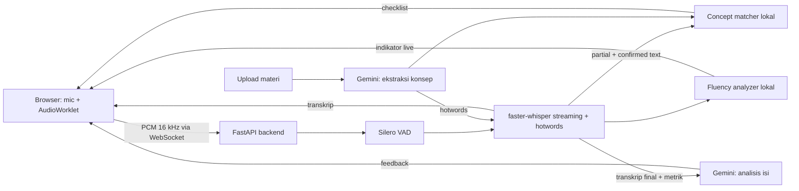
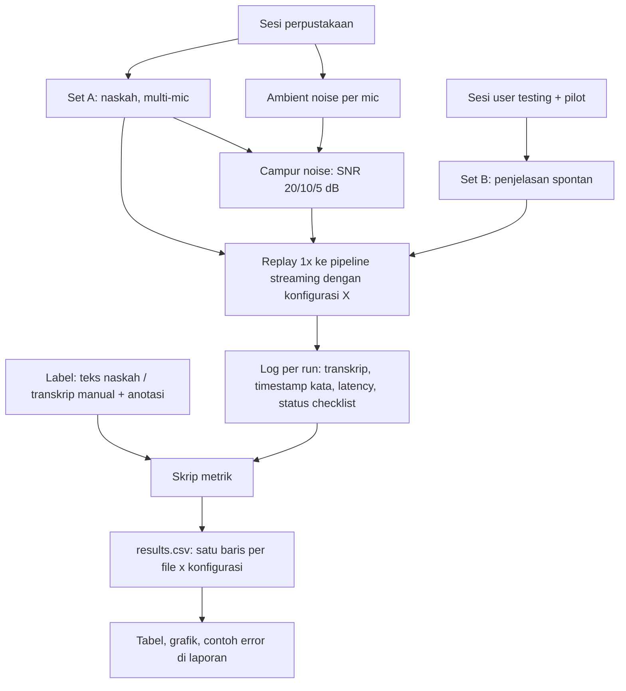

# Rencana Final Project — Feynman Speech Coach (COMP6822001)

Sep 26, 2026 · @Joda

## 1. Ringkasan project

Feynman Speech Coach adalah web app lokal tempat mahasiswa CS berlatih menjelaskan satu konsep secara lisan dengan metode Feynman. Whisper lokal mentranskrip secara real-time, checklist konsep menyala saat konsep disebut dan dijelaskan, lalu di akhir sesi user menerima feedback tentang kelancaran, cakupan konsep, kebenaran isi, dan kesederhanaan penjelasan.

Deliverables sesuai guideline: (1) aplikasi real-time yang berjalan lokal, dan (2) technical report dengan evaluasi teknis, user testing minimal 5 user, dan AI Usage Log.

Prinsip desain yang mengikat semua keputusan di dokumen ini:

- **Speech adalah inti, LLM pendukung.** Semua yang bisa dihitung dari sinyal suara (jeda, speech rate, filler, deteksi konsep live) dikerjakan lokal. Gemini hanya untuk analisis isi pasca-sesi.
- **Satu alur cerita.** Setiap eksperimen harus menjawab pertanyaan yang relevan untuk fitur Feynman, bukan eksperimen sampingan.
- **Gratis dan lokal.** Tidak ada komponen berbayar. ASR tidak pernah memakai API eksternal.
- **Reproducible.** Rekam sekali, putar ulang ke pipeline berkali-kali untuk setiap konfigurasi.
- **Siap berubah.** Model ASR bisa diganti lewat konfigurasi, sehingga fine-tuning bisa ditambahkan belakangan tanpa mengubah aplikasi.

## 2. Status keputusan

Sebagian besar arsitektur sudah final; dua keputusan masih bergantung pada konfirmasi Pak Hidayat dan harus diselesaikan sebelum coding dimulai.

| Topik | Keputusan | Status |
| --- | --- | --- |
| Model ASR | Whisper pretrained via faster-whisper, dijalankan lokal | Masih mencari model terbaik di huggingface yang dapat digunakan untuk kasus ini |
| Fine-tuning Whisper | Tidak dilakukan dulu; ditambahkan hanya jika diwajibkan eksplisit | Menunggu konfirmasi |
| Detektor filler terlatih | Dibatalkan; filler dideteksi secara heuristik, detektor terlatih jadi future work | Final |
| LLM analisis isi | Gemini (Flash) via Google AI Studio free tier, tanpa kartu kredit | Final, perlu dikonfirmasi boleh dipakai |
| Adaptasi domain | Hotwords/prompt dari materi yang di-upload (tanpa training) | Final |
| Checklist konsep live | Dua status: disebut (fuzzy match) dan dijelaskan (embedding lokal) | Final |
| Bahasa | Bahasa Indonesia dengan istilah CS dalam bahasa Inggris (code-switching alami) | Final |
| Deployment | Lokal di laptop (RTX 3050 6 GB); deploy publik di luar scope | Final |
| Frontend | React + Vite + TypeScript + Tailwind; target kualitas produk, bukan sekadar berjalan | Final |

Pesan untuk Pak Hidayat (kirim tertulis, simpan jawabannya sebagai bukti):

1. Whisper yang dipakai adalah model open-source dari Hugging Face yang berjalan lokal, bukan OpenAI API. Apakah boleh dipakai sebagai pretrained model tanpa fine-tuning?
2. Gemini API hanya dipakai untuk menganalisis teks transkrip, bukan untuk speech recognition. Apakah ini diperbolehkan?

Jika fine-tuning diwajibkan, jalur cadangannya ada di bagian 12 (Risiko).

## 3. Problem, target user, dan skenario

**Target user:** mahasiswa Computer Science BINUS yang sedang mempersiapkan ujian dan ingin menguji pemahaman konsep dengan menjelaskannya secara lisan.

**Problem:** mahasiswa sering merasa sudah paham setelah membaca slide, tapi gagal saat harus menjelaskan. Metode Feynman membantu, tapi belajar sendiri tidak memberi feedback: tidak ada yang menunjukkan konsep mana yang terlewat, istilah mana yang dipakai tanpa dijelaskan, atau di bagian mana penjelasannya tidak lancar.

**Solusi:** aplikasi mendengarkan penjelasan secara real-time, menandai konsep yang sudah tercakup, lalu memberi feedback terstruktur tentang gap, kesalahan isi, istilah yang tidak dijelaskan, dan kelancaran. User bisa mengulang sesi dan melihat perbandingannya.

**Skenario pemakaian:**

- Belajar mandiri di kos atau perpustakaan menjelang UTS/UAS, satu subtopik per sesi (2–5 menit bicara).
- Mentor menyiapkan penjelasan sebelum sesi mentoring.
- Kondisi realistis: mic laptop atau earphone, ruangan dengan noise ringan.

**Yang perlu divalidasi sebelum build (bukti relevansi user):** tanya singkat 5–10 calon user apakah mereka pernah memakai metode Feynman atau belajar dengan menjelaskan, dan apa kesulitannya. Catat jawabannya; ini jadi bukti untuk komponen rubrik Real-World Problem & Target User.

## 4. Fitur dan user flow

Satu sesi terdiri dari empat tahap: siapkan topik, jelaskan secara lisan, terima feedback, lalu ulangi.

**Tahap 1 — Setup topik**

1. User mengetik topik (misalnya "Backpropagation").
2. Opsional: upload materi (PDF, PPTX, TXT/MD, atau paste teks) dan pilih rentang halaman/slide yang relevan.
3. Gemini mengekstrak 4–8 konsep kunci. Setiap konsep punya nama, alias Indonesia/Inggris, dan deskripsi 1–2 kalimat.
4. User meninjau daftar konsep: bisa edit, hapus, atau tambah. Daftar final dipakai untuk checklist dan hotwords Whisper.
5. Tanpa materi: konsep diekstrak dari pengetahuan Gemini, dan UI menandai bahwa acuannya bukan materi user.

**Tahap 2 — Menjelaskan (real-time)**

- Transkrip partial muncul saat user bicara; teks yang sudah dikonfirmasi dibedakan dari teks yang masih bisa berubah.
- Checklist konsep: abu-abu (belum), kuning (disebut), hijau (dijelaskan).
- Indikator live: speech rate, penghitung filler, peringatan jeda panjang, status (listening/processing), dan latency.
- Tombol Start/Stop.

**Tahap 3 — Feedback pasca-sesi**

- Metrik kelancaran lokal: durasi, kata/menit, jumlah dan lokasi jeda panjang, filler rate.
- Cakupan konsep: status akhir tiap konsep, diverifikasi ulang oleh Gemini.
- Analisis isi: bagian yang benar, kesalahan faktual, gap, dan istilah teknis yang dipakai tanpa dijelaskan.
- Ringkasan: 2–3 hal yang sudah bagus dan 2–3 hal prioritas untuk diperbaiki.
- Transkrip lengkap dengan jeda dan filler ditandai.

**Tahap 4 — Iterasi**

- Tombol "Jelaskan ulang" memakai daftar konsep yang sama.
- Perbandingan sesi: konsep yang sebelumnya terlewat kini tercakup atau belum, perubahan filler rate dan jeda.

**Prioritas fitur**

| Fitur | Prioritas |
| --- | --- |
| Streaming ASR + transkrip partial | MVP (wajib guideline) |
| Metrik kelancaran lokal | MVP |
| Analisis isi Gemini (mode tanpa materi) | MVP |
| Upload materi + ekstraksi konsep + review user | MVP |
| Hotwords dari materi | MVP (eksperimen inti) |
| Checklist konsep live (dua status) | MVP |
| Indikator live (speech rate, filler, jeda) | Should-have |
| Iterasi dan perbandingan sesi | Should-have |
| Riwayat sesi tersimpan | Nice-to-have |
| Pertanyaan lanjutan ala "murid penasaran" dari Gemini | Nice-to-have |

## 5. Arsitektur sistem dan tech stack

Arsitekturnya client–server lokal: browser menangkap audio dan menampilkan hasil, backend FastAPI menjalankan seluruh pemrosesan speech di GPU laptop, dan hanya teks yang dikirim ke Gemini.



Aliran data kunci: audio tidak pernah keluar dari laptop. Gemini hanya menerima teks materi, daftar konsep, transkrip, dan metrik.

| Lapisan | Pilihan | Alasan |
| --- | --- | --- |
| Frontend | React + Vite + TypeScript, Tailwind CSS, Web Audio API + AudioWorklet | Capture mic langsung di browser; state UI yang kompleks (partial/confirmed, checklist tiga status, indikator live, halaman feedback, perbandingan sesi) lebih rapi dan mudah diuji sebagai komponen bertipe |
| Transport | WebSocket | Dua arah, latency rendah untuk audio masuk dan partial keluar |
| Backend | Python 3.11, FastAPI, uvicorn | Ekosistem ML Python, dukungan WebSocket native |
| ASR | faster-whisper (CTranslate2), model small/medium/large-v3-turbo | Lebih cepat dan hemat VRAM dari Whisper asli; mendukung `hotwords`, `initial_prompt`, word timestamps |
| Streaming policy | Pola LocalAgreement (referensi repo `whisper_streaming`) | Whisper bukan model streaming; perlu kebijakan konfirmasi partial |
| VAD | Silero VAD | Segmentasi ucapan, deteksi jeda, mencegah halusinasi saat hening |
| Embedding konsep | sentence-transformers multilingual kecil (keluarga MiniLM atau e5-small), jalan di CPU | Deteksi "dijelaskan" tanpa berebut VRAM |
| Fuzzy match | rapidfuzz | Deteksi "disebut" yang tahan salah eja ASR |
| Parsing materi | PyMuPDF (PDF), python-pptx (PPTX), LibreOffice headless (PPTX ke PDF bila perlu) | Gemini juga bisa menerima PDF langsung |
| LLM | Gemini Flash via SDK `google-genai`, output JSON terstruktur | Free tier, tanpa kartu kredit |
| Penyimpanan | File JSON/SQLite lokal per sesi | Cukup untuk riwayat sesi dan data eksperimen |
| Evaluasi | jiwer (WER/CER), skrip replay audio, pandas, matplotlib | Metrik standar dan reproducible |

Semua parameter penting (nama model, compute type, ukuran chunk, bahasa, threshold similarity, nama model Gemini) diletakkan di satu file konfigurasi, bukan hardcode.

## 6. Pipeline ASR real-time

Pipeline memenuhi definisi real-time guideline dengan memproses audio per chunk selama user bicara dan mengirim transkrip partial yang terus diperbarui, tanpa menunggu rekaman selesai.

1. **Capture.** AudioWorklet mengambil audio mic, resample ke 16 kHz mono, lalu mengirim chunk PCM 16-bit (misalnya tiap 100–250 ms) lewat WebSocket.
2. **Buffer + VAD.** Backend menampung audio dalam rolling buffer. Silero VAD menandai segmen ucapan dan jeda; timestamp jeda disimpan untuk metrik kelancaran.
3. **Inference berkala.** Setiap interval (nilai awal sekitar 1 detik, diatur di konfigurasi), faster-whisper mentranskrip buffer yang belum dikonfirmasi, dengan `hotwords` dari daftar konsep dan `word_timestamps=True`.
4. **Konfirmasi (LocalAgreement).** Kata yang konsisten di dua inference berturut-turut dianggap confirmed; sisanya tetap partial. Audio yang sudah confirmed dipotong dari buffer supaya waktu inference tidak terus membesar.
5. **Kirim ke UI.** Server mengirim pesan JSON: teks confirmed, teks partial, timestamp, dan latency.
6. **Akhir sesi.** Saat Stop, sisa buffer di-flush, lalu transkrip final beserta word timestamps dan jeda disimpan.

**Definisi pengukuran latency (tulis persis di laporan):**

- *Partial latency:* waktu dari akhir sebuah kata diucapkan (dari timestamp audio) sampai kata itu pertama kali tampil sebagai partial.
- *Confirmation latency:* waktu sampai kata itu berstatus confirmed.
- *Real-time factor (RTF):* waktu inference dibagi durasi audio yang diproses; harus jauh di bawah 1 agar sistem tidak tertinggal.
- *End-of-session delay:* waktu dari Stop sampai transkrip final siap (feedback Gemini diukur terpisah).

**Hal teknis yang harus diantisipasi:**

- Halusinasi Whisper saat hening atau noise (misalnya kalimat "terima kasih" yang muncul sendiri): cegah dengan VAD, dan catat kasus yang lolos untuk error analysis.
- Konteks antar-chunk: kirim teks confirmed sebelumnya sebagai prompt agar kalimat tidak terputus secara aneh.
- Deteksi bahasa per chunk bisa melompat: parameter bahasa diuji di eksperimen (bagian 8).
- VRAM 6 GB: mulai dari model small (compute type int8\_float16), naikkan ukuran setelah pipeline stabil.

## 7. Modul analisis

Ada tiga modul analisis. Dua berjalan lokal selama sesi, satu (Gemini) hanya setelah sesi selesai.

### 7.1 Kelancaran (lokal, heuristik)

| Metrik | Sumber | Catatan |
| --- | --- | --- |
| Speech rate (kata/menit) | Word timestamps Whisper | Hitung tanpa jeda panjang agar tidak bias |
| Jeda panjang | VAD | Ambang awal sekitar 1,5–2 detik, dikalibrasi dari data |
| Filler vokal ("eee", "emm") | `initial_prompt` berisi contoh filler agar Whisper ikut menuliskannya | Heuristik; efektivitasnya harus diukur |
| Filler leksikal ("jadi", "kayak", "gitu") | Hitung dari transkrip | Ambigu karena juga kata normal; laporkan sebagai indikasi, bukan skor |
| Pengulangan/restart | Kata berulang berurutan di transkrip | Opsional |

Feedback kelancaran ditampilkan sebagai lokasi ("tersendat 3 kali saat menjelaskan chain rule"), bukan hanya angka. Detektor filler terlatih dicatat sebagai future work.

### 7.2 Checklist konsep live (lokal)

- **Disebut:** nama atau alias konsep muncul di teks confirmed. Pakai rapidfuzz dengan ambang similarity (nilai awal sekitar 85) agar tahan salah eja ASR.
- **Dijelaskan:** embedding dari jendela 2–3 kalimat terakhir dibandingkan dengan embedding deskripsi konsep; di atas threshold berarti dijelaskan. Threshold dikalibrasi dari data pilot.
- Hanya dijalankan pada teks confirmed supaya checklist tidak berkedip.
- Status akhir diverifikasi ulang oleh Gemini setelah sesi. Checklist live bersifat indikasi.

### 7.3 Analisis isi (Gemini, pasca-sesi)

**Panggilan 1 — Ekstraksi konsep (saat setup).** Input: topik dan materi (PDF langsung, atau teks hasil ekstraksi). Output JSON: daftar konsep berisi `name`, `aliases`, `description`.

**Panggilan 2 — Analisis penjelasan (setelah Stop).** Input: topik, daftar konsep final, transkrip, metrik kelancaran, dan ringkasan materi bila ada. Output JSON:

- `concept_coverage`: status tiap konsep (tidak dibahas / disebut / dijelaskan dengan benar / dijelaskan dengan keliru) beserta kutipan transkrip sebagai bukti.
- `factual_errors`: pernyataan keliru dan koreksinya.
- `unexplained_jargon`: istilah teknis yang dipakai tanpa dijelaskan.
- `strengths` dan `improvements`: masing-masing 2–3 poin, konkret.
- `simplicity_note`: seberapa mudah penjelasan dipahami orang awam.

**Aturan prompt yang wajib:**

- Beri tahu Gemini bahwa transkrip berasal dari ASR dan bisa mengandung salah eja istilah teknis; kesalahan transkripsi jangan dianggap kesalahan pemahaman.
- Minta bukti berupa kutipan transkrip untuk setiap penilaian, supaya feedback bisa diverifikasi.
- Validasi JSON output; bila gagal parse atau kena rate limit (HTTP 429), retry dengan backoff. Bila tetap gagal, tampilkan feedback lokal saja.

**Batasan yang dicatat di laporan:** slide hanya ringkasan sehingga bukan kunci jawaban lengkap; mode tanpa materi berisiko halusinasi; input di free tier dapat dipakai Google untuk meningkatkan produknya, sehingga peserta user testing harus diberi tahu.

## 8. Rancangan eksperimen teknis

Semua eksperimen memakai satu alur yang sama: rekam sekali, beri label, putar ulang rekaman ke pipeline dengan konfigurasi berbeda, lalu hitung metrik dari log yang sama. Bagian ini mengikuti urutan alur itu, dari pertanyaan yang ingin dijawab sampai output yang masuk ke laporan.

### 8.1 Pertanyaan evaluasi

Setiap eksperimen harus menjawab satu pertanyaan yang relevan untuk aplikasi; eksperimen yang tidak menjawab pertanyaan apa pun tidak dikerjakan.

| ID | Pertanyaan | Dijawab oleh |
| --- | --- | --- |
| Q1 | Seberapa akurat sistem saat user menjelaskan secara spontan? | Evaluasi akhir (F) |
| Q2 | Seberapa responsif transkripsi real-time? | Semua run (latency dicatat otomatis), terutama E1 dan E6 |
| Q3 | Ukuran model mana yang memberi trade-off akurasi dan latency terbaik di RTX 3050? | E1 |
| Q4 | Apakah hotwords dari materi memperbaiki pengenalan istilah teknis dan checklist konsep? | E2, F |
| Q5 | Seberapa besar pengaruh jenis mic dan noise terhadap akurasi? | E3, E4 |
| Q6 | Seberapa andal checklist konsep dan metrik kelancaran dibanding penilaian manusia? | E7 |

Jawaban Q1–Q6 inilah yang nanti digabungkan dengan hasil user testing di bab Discussion.

### 8.2 Alur evaluasi

Data dikumpulkan dua kali saja (sesi perpustakaan dan sesi user testing); semua eksperimen setelahnya hanya menjalankan ulang rekaman yang sama dengan konfigurasi berbeda.



Cara membaca diagram:

1. **Rekaman** disimpan sebagai file WAV beserta metadata; tidak ada eksperimen yang memakai mic secara langsung.
2. **Label** dibuat sekali per file: teks naskah untuk Set A, transkrip manual dan anotasi untuk Set B.
3. **Replay** mengalirkan file ke pipeline yang sama persis dengan aplikasi (VAD, streaming, konfirmasi partial) pada kecepatan 1x, sehingga latency yang tercatat sama seperti saat dipakai langsung.
4. **Log** setiap run disimpan per konfigurasi, lalu skrip metrik membandingkannya dengan label.
5. **results.csv** menjadi satu-satunya sumber angka untuk semua tabel dan grafik, sehingga setiap angka di laporan bisa dilacak ke run-nya.

### 8.3 Pengumpulan dan pelabelan data

Ada tiga jenis rekaman dengan peran berbeda: Set A untuk membandingkan konfigurasi secara murah dan adil, Set B untuk angka akurasi di kondisi nyata dan untuk menguji fitur, ambient noise untuk membuat kondisi bising secara terkontrol.

|  | Set A — naskah | Set B — spontan | Ambient noise |
| --- | --- | --- | --- |
| Isi | Kalimat penjelasan CS dibacakan, 1–2 menit per orang per naskah | Penjelasan bebas 2–4 menit per topik | 5–10 menit suara perpustakaan tanpa pembicara |
| Kapan | Sesi perpustakaan (bisa ditambah Task 1 user testing) | Task 2 user testing + rekaman pilot | Sesi perpustakaan |
| Mic | Serentak di mic laptop dan earphone (clip-on bila ada) | Mic laptop (earphone opsional) | Serentak di semua mic yang dipakai Set A |
| Label | Teks naskah, dikoreksi bila pembaca menyimpang | Transkrip verbatim manual + anotasi konsep, jeda, filler | Tidak perlu |
| Dipakai di | E1–E6 | F, E2 (checklist), E7 | E4 |
| Target ukuran | 6–8 pembicara × 2 naskah | 5–8 rekaman | 1 rekaman per mic |

**Peran A vs B.** Set A untuk **perbandingan relatif** antar konfigurasi karena kondisinya terkontrol dan labelnya gratis. Set B memberi **angka akurasi utama** di laporan dan memverifikasi bahwa urutan konfigurasi terbaik dari A tetap sama di bicara spontan. WER di A diperkirakan lebih rendah daripada B; selisihnya dilaporkan sebagai temuan.

**Membuat naskah Set A:**

1. Rekam penjelasan spontanmu sendiri untuk 3–4 topik, lalu transkrip.
2. Rapikan menjadi naskah 150–250 kata per topik, tetap mempertahankan gaya lisan ("jadi", "nah") dan istilah Inggris. Ini memperkecil jarak antara bacaan dan bicara spontan.
3. Daftar istilah teknis tiap naskah dicatat terpisah; daftar ini dipakai untuk term WER dan sebagai hotwords di E2.

**Melabeli Set B:**

1. Buat draf transkrip dengan Whisper large, lalu koreksi manual kata per kata sambil mendengarkan. Catat penggunaan draf ini di AI Usage Log, dan waspadai bias ikut menerima kesalahan draf.
2. Tandai filler vokal (misalnya `<eee>`) dan jeda di atas 1,5 detik dengan timestamp (label track Audacity cukup).
3. Untuk setiap konsep di daftar konsep, catat detik saat konsep pertama kali disebut dan saat mulai dijelaskan. Ini kunci jawaban untuk checklist.

**Sesi rekaman di perpustakaan kampus:**

- Rekam semua pembicara di sudut atau ruang diskusi paling tenang; ini versi bersih.
- Rekam ambient perpustakaan terpisah dengan semua mic sekaligus, di posisi, gain, dan format yang sama.
- Minta izin pengelola atau pakai ruang diskusi; semua pembicara mengisi formulir consent sebelum direkam.

**Aturan rekaman untuk semua set:** WAV mono (rekam 48 kHz lalu turunkan ke 16 kHz, atau langsung 16 kHz); noise suppression, echo cancellation, dan auto gain OS/browser dimatikan; posisi mic dicatat.

**Pemisahan kalibrasi dan evaluasi.** Threshold checklist dan ambang jeda dikalibrasi hanya dengan rekaman pilot suaramu sendiri. Set B dari peserta hanya dipakai untuk evaluasi, supaya hasilnya tidak bias oleh data yang dipakai untuk menyetel sistem.

**Metadata** disimpan di `eval/data/metadata.csv` dengan kolom: file\_id, set, speaker\_id, topik, mic, lokasi, kondisi noise/SNR, durasi, status consent.

### 8.4 Metrik

Semua metrik dihitung otomatis dari log run dan label; tidak ada angka yang diisi manual.

```latex
WER = \frac{S + D + I}{N}
```

| Metrik | Definisi | Butuh label | Dipakai di |
| --- | --- | --- | --- |
| WER / CER | Error kata / karakter terhadap reference setelah normalisasi | Transkrip | Semua eksperimen |
| Term recall | Persentase kemunculan istilah teknis di reference yang muncul benar di hasil | Daftar istilah | E1, E2, F |
| WER per jenis token | WER terpisah untuk token istilah Inggris dan token bahasa Indonesia | Transkrip + daftar istilah | F, error analysis |
| Partial latency | Akhir kata diucapkan sampai kata itu pertama kali tampil | Tidak (dari log) | Semua run |
| Confirmation latency | Akhir kata diucapkan sampai kata itu confirmed | Tidak | Semua run |
| RTF | Waktu inference / durasi audio | Tidak | E1, E6 |
| VRAM puncak | Memori GPU maksimum selama run | Tidak | E1 |
| Precision/recall checklist | Status "disebut" dan "dijelaskan" dibanding anotasi manual | Anotasi konsep | E2, E7 |
| Detection delay | Saat konsep mulai dijelaskan sampai checklist hijau | Anotasi konsep | E7 |
| Precision/recall jeda dan filler | Deteksi heuristik dibanding anotasi manual | Anotasi jeda/filler | E7 |

**Aturan agregasi:**

- WER dihitung di level korpus (total error dibagi total kata), bukan rata-rata WER per file, supaya file pendek tidak mendominasi. Sebaran per pembicara tetap dilaporkan.
- Latency dilaporkan sebagai median dan persentil ke-90, bukan rata-rata, karena distribusinya miring.
- Setiap run dilakukan sekali per konfigurasi karena replay deterministik; latency dicek ulang di satu konfigurasi untuk memastikan variasinya kecil.

**Normalisasi teks** ditetapkan sebelum menghitung metrik apa pun dan dicantumkan di laporan: huruf kecil, hapus tanda baca, penulisan baku untuk kata gabungan ("nge-update" vs "ngeupdate", "dataset" vs "data set"), singkatan ("ML" vs "machine learning"), dan filler dikeluarkan dari perhitungan WER.

### 8.5 Rencana eksperimen

Setiap eksperimen mengubah tepat satu variabel dari konfigurasi baseline, lalu hasil terbaiknya dikunci untuk eksperimen berikutnya.

**Konfigurasi baseline:** Whisper small (int8), bahasa `id`, tanpa hotwords, interval inference 1 detik, mic laptop, ruangan tenang. Ini "kondisi normal" sesuai guideline.

| ID | Pertanyaan | Data | Divariasikan | Dikunci | Metrik | Output | Prioritas |
| --- | --- | --- | --- | --- | --- | --- | --- |
| E1 | Q3 | A, mic laptop | small, medium, large-v3-turbo | Konfigurasi baseline lainnya | WER, CER, term recall, latency, RTF, VRAM | Tabel perbandingan model + grafik WER vs latency | Wajib |
| E2 | Q4 | A, mic laptop; B untuk checklist | Tanpa vs dengan hotwords | Model terbaik E1 | Term recall, WER keseluruhan, recall checklist | Tabel sebelum/sesudah + grafik term recall per topik | Wajib |
| E3 | Q5 | A, semua mic (serentak) | Laptop, earphone, clip-on bila ada | Konfigurasi final E1–E2 | WER, CER, term recall | Tabel per mic | Wajib |
| E4 | Q5 | A bersih + A dicampur noise | Bersih, SNR 20, 10, 5 dB | Konfigurasi final, mic laptop | WER, term recall | Grafik WER vs SNR | Bila sempat |
| E5 | Q3 | A, mic laptop | Bahasa `id`, `en`, auto-detect | Konfigurasi final | WER, WER per jenis token | Tabel per setelan bahasa | Bila sempat |
| E6 | Q2 | A, mic laptop | Interval 0,5 / 1 / 2 detik | Konfigurasi final | Latency, RTF, WER | Grafik latency vs WER | Opsional |
| E7 | Q6 | B beranotasi | Tidak ada (validasi fitur) | Konfigurasi final | P/R checklist, detection delay, P/R jeda dan filler | Tabel validasi fitur | Wajib (checklist), bila sempat (jeda/filler) |
| F | Q1, Q4 | B | Baseline vs konfigurasi final | Mic laptop | WER, CER, term recall, WER per jenis token, latency | Tabel angka utama laporan | Wajib |

**Urutan pengerjaan:**

1. E1 untuk memilih model; pertimbangkan akurasi dan latency bersama, bukan WER saja.
2. E2 dengan model terpilih untuk memutuskan hotwords dipakai atau tidak. Hasilnya membentuk konfigurasi final.
3. E3 dan E4 dengan konfigurasi final untuk melihat ketahanannya terhadap kondisi input.
4. F di Set B: angka utama yang menjawab "seberapa akurat dan responsif sistem ini untuk user nyata", sekaligus mengecek apakah perbaikan dari E2 tetap berlaku di bicara spontan.
5. E7 di Set B untuk memvalidasi fitur yang dilihat user.
6. E5 dan E6 bila waktu masih ada.

Guideline hanya mewajibkan baseline ditambah satu kondisi. Beban kerja terbesar ada di pelabelan Set B, bukan jumlah eksperimen di Set A, karena setiap eksperimen A hanya berarti menjalankan ulang skrip replay.

### 8.6 Error analysis

Error analysis diambil dari run F (Set B, konfigurasi final) ditambah contoh mencolok dari E3/E4, dengan minimal 15–20 contoh yang dikategorikan dan ditelusuri dampaknya ke fitur.

1. Skrip metrik menyimpan alignment kata per file (substitution, deletion, insertion) dari jiwer.
2. Ambil contoh error secara acak per kategori, bukan hanya yang lucu atau ekstrem.
3. Kategorikan: istilah teknis Inggris, singkatan, nama/proper noun, filler yang hilang atau salah, halusinasi saat hening, error akibat noise, kata terpotong di batas chunk, dan suara orang lain yang ikut tertranskrip.
4. Untuk setiap contoh, cek dampaknya: apakah checklist gagal menyala, dan apakah feedback Gemini menilai salah karena error ini (error propagation).

Format tabel di laporan:

| Reference | Output sistem | Tipe | Kategori | Dampak ke fitur |
| --- | --- | --- | --- | --- |
| *(diisi dari hasil run F)* |  |  |  |  |

### 8.7 Output yang dihasilkan

Eksperimen menghasilkan tiga lapis output: file mentah yang bisa diaudit, satu tabel hasil gabungan, dan tabel/grafik yang masuk ke laporan.

**File (di repository `eval/`):**

- `data/metadata.csv`, rekaman WAV, dan label (naskah, transkrip manual, anotasi).
- `runs/<konfigurasi>/<file_id>.json`: log per run berisi transkrip, timestamp kata, latency per kata, dan status checklist.
- `results/results.csv`: satu baris per file × konfigurasi dengan semua metrik; sumber tunggal semua angka di laporan.

**Tabel dan grafik untuk laporan (Bab 5):**

| Kode | Isi | Dari |
| --- | --- | --- |
| T1 | Perbandingan model: WER, CER, term recall, median/P90 latency, RTF, VRAM | E1 |
| G1 | Scatter WER vs latency per model (trade-off) | E1 |
| T2 | Tanpa vs dengan hotwords: term recall, WER, recall checklist | E2 |
| T3 | Akurasi per jenis mic | E3 |
| G2 | WER vs SNR | E4 |
| T4 | Validasi fitur: P/R checklist, detection delay, P/R jeda dan filler | E7 |
| T5 | Angka utama: baseline vs final di Set B, termasuk WER istilah Inggris vs bahasa Indonesia | F |
| G3 | Distribusi latency konfigurasi final | F |
| T6 | Contoh error dan kategori, plus grafik frekuensi kategori | 8.6 |
| – | 3–5 contoh transkrip real-time berdampingan dengan reference | F |

**Keterkaitan ke bab lain:** T5 dan G3 menjawab dua pertanyaan wajib guideline (seberapa akurat, seberapa responsif). T2, T4, dan T6 dipasangkan dengan skor kuesioner di Bab 6, misalnya term recall dengan penilaian "transkrip istilah teknis akurat" dan recall checklist dengan "checklist membantu", lalu dibahas bersama di Bab 7.

## 9. Rancangan user testing

Target minimal 5 peserta, idealnya 6–8 sebagai cadangan, semuanya mahasiswa CS BINUS yang sesuai target user. Setiap sesi sekitar 30–40 menit, dilakukan setelah MVP stabil.

**Karakteristik yang dicatat per peserta:** semester, pernah memakai metode Feynman atau tidak, kebiasaan belajar, perangkat/mic yang dipakai, dan topik yang dipilih.

**Prosedur per sesi:**

1. **Informed consent** (tertulis): audio direkam untuk evaluasi, transkrip dikirim ke Gemini free tier yang dapat dipakai Google untuk meningkatkan produknya, data dipakai hanya untuk tugas kuliah, dan peserta boleh berhenti kapan saja.
2. **Pre-questionnaire** singkat: pengalaman belajar dan tingkat percaya diri terhadap topik (skala 1–5).
3. **Task 1:** bacakan naskah pendek 1–2 menit (menghasilkan data set A).
4. **Task 2:** pilih satu topik dari mata kuliah yang sedang diambil, upload materinya, tinjau daftar konsep, lalu jelaskan 2–4 menit.
5. **Task 3:** baca feedback, lalu jelaskan ulang topik yang sama.
6. **Observasi** selama task: kebingungan UI, apakah peserta melihat layar saat bicara, reaksi terhadap checklist, dan error yang terlihat. Catat dengan lembar observasi terstruktur.
7. **Post-questionnaire** dan wawancara singkat 5–10 menit.

**Kuesioner (skala 1–5):**

| Aspek | Contoh pernyataan |
| --- | --- |
| Ease of use | Aplikasi mudah dipakai tanpa penjelasan panjang. |
| Responsiveness | Transkrip muncul cukup cepat saat saya bicara. |
| Transcription quality | Transkrip, termasuk istilah teknis, cukup akurat. |
| Checklist usefulness | Checklist konsep membantu saya tahu apa yang belum dijelaskan. |
| Distraction | Tampilan live tidak mengganggu konsentrasi saat menjelaskan. |
| Feedback usefulness | Feedback membantu saya menemukan bagian yang belum saya pahami. |
| Feedback accuracy | Feedback sesuai dengan apa yang sebenarnya saya jelaskan. |
| Overall satisfaction | Saya akan memakai aplikasi ini untuk belajar. |

Tambahkan SUS (System Usability Scale, 10 item standar) bila waktu cukup, karena skornya bisa dibandingkan dengan benchmark umum.

**Pertanyaan wawancara:** bagian mana yang paling membantu; kapan feedback terasa salah atau tidak adil; apakah checklist live membantu atau mengganggu; fitur apa yang kurang; apakah akan dipakai sebelum ujian dan kenapa.

**Analisis:**

- Tabel skor per peserta per aspek, plus rata-rata dan sebaran.
- Kelompokkan feedback kualitatif ke kategori guideline: usability, recognition, latency, interaksi membingungkan, fitur berguna, fitur kurang, kepuasan.
- Hubungkan setiap temuan user dengan data teknis. Contoh: keluhan istilah salah transkrip dibandingkan dengan term WER; penilaian "feedback tidak adil" dicek apakah bersumber dari error ASR.
- Bandingkan sesi pertama dan sesi ulang per peserta (cakupan konsep, filler rate).

## 10. Checklist persiapan sebelum coding

Semua item di bawah bisa dikerjakan tanpa biaya dan sebagian besar selesai dalam satu minggu.

**Konfirmasi dan administrasi**

- [ ] Kirim pesan tertulis ke Pak Hidayat (dua pertanyaan di bagian 2) dan simpan jawabannya.
- [ ] Tentukan judul project.
- [ ] Validasi masalah ke 5–10 calon user (bagian 3) dan catat jawabannya.

**Akun dan kredensial**

- [ ] Buat API key di Google AI Studio; cek limit RPM/RPD aktif di halaman project AI Studio dan catat nilainya.
- [ ] Simpan API key di file `.env` yang masuk `.gitignore`; jangan pernah commit.
- [ ] Buat repository GitHub (private dulu).

**Environment laptop**

- [ ] Pastikan driver NVIDIA, CUDA, dan cuDNN kompatibel dengan versi CTranslate2 yang dipakai faster-whisper.
- [ ] Python 3.11 dengan virtual environment; Node.js untuk React + Vite.
- [ ] Uji cepat: faster-whisper small mentranskrip satu file WAV di GPU; catat VRAM dan waktu proses.
- [ ] Install LibreOffice bila ingin konversi PPTX ke PDF.

**Bahan dan data**

- [ ] Pilih 3–4 topik CS dari mata kuliah yang sedang diambil calon peserta, dan siapkan materinya (PDF/PPTX).
- [ ] Tulis naskah bacaan untuk set A (sekitar 150–250 kata per topik, padat istilah teknis, gaya bicara natural).
- [ ] Tetapkan aturan normalisasi teks untuk WER.
- [ ] Siapkan template anotasi (reference transcript, timestamp jeda, filler, konsep yang dijelaskan).
- [ ] Rekam data pilot suaramu sendiri (baseline, beberapa topik) untuk kalibrasi threshold.

**Perangkat rekaman**

- [ ] Mic laptop (baseline) dan earphone/TWS.
- [ ] Mic clip-on hanya jika bisa dipinjam; jangan beli.
- [ ] Cara merekam simultan (dua perangkat atau dua input di satu laptop) sudah diuji.

**Dokumen user testing**

- [ ] Formulir informed consent.
- [ ] Pre- dan post-questionnaire (Google Forms).
- [ ] Lembar observasi dan daftar pertanyaan wawancara.
- [ ] Jadwal dan daftar calon peserta (minimal 6–8 orang).

**Dokumentasi**

- [ ] `AI_LOG.md` sudah siap dan diisi sejak entri pertama (termasuk percakapan perencanaan ini).
- [ ] Folder screenshot dan catatan eksperimen (tanggal, konfigurasi, hasil).

## 11. Fase implementasi

Fase 0–4 sudah memenuhi semua syarat wajib guideline; fase 5–6 menambah nilai analisis. Deadline pengumpulan belum dicantumkan di sini: isi kolom estimasi setelah jadwal ujian keluar dan sisakan minimal dua minggu terakhir untuk laporan.

| Fase | Isi | Definition of done | Estimasi |
| --- | --- | --- | --- |
| 0. Persiapan | Checklist bagian 10, konfirmasi dosen | Jawaban dosen tersimpan; faster-whisper jalan di GPU; data pilot terekam | 1 minggu |
| 1. Streaming ASR | Capture mic, WebSocket, VAD, faster-whisper, LocalAgreement, UI transkrip | Transkrip partial dan confirmed tampil saat bicara; latency ditampilkan; stabil 5 menit tanpa crash | 1,5–2 minggu |
| 2. Replay dan evaluasi | Skrip replay file ke pipeline, perhitungan WER/CER/term WER, log latency | Satu perintah menghasilkan tabel metrik untuk satu konfigurasi | 1 minggu |
| 3. Kelancaran + Gemini | Metrik kelancaran lokal, analisis isi (mode tanpa materi), halaman feedback | Setelah Stop, feedback JSON tervalidasi tampil; fallback lokal jalan saat API gagal | 1 minggu |
| 4. Materi + konsep | Upload dan parsing materi, ekstraksi konsep, review user, hotwords, checklist dua status | Checklist menyala saat konsep dijelaskan; hotwords terpasang dari daftar konsep | 1,5 minggu |
| 5. Eksperimen | Rekam set A dan B, jalankan E1–E7 dan F sesuai prioritas, error analysis | Semua tabel dan grafik eksperimen jadi; threshold terkalibrasi | 1,5 minggu |
| 6. User testing | Sesi dengan 5+ peserta, iterasi kecil bila ada bug kritis | Data kuesioner, observasi, dan wawancara lengkap | 1–1,5 minggu |
| 7. Laporan | Tulis bab 1–8, AI Usage Log, deklarasi, screenshot, persiapan demo | Laporan lengkap sesuai struktur guideline | 2 minggu |

Fitur should-have (indikator live, iterasi sesi) dikerjakan di sela fase 4–5 bila waktu cukup. Jangan menambah fitur setelah user testing dimulai, kecuali perbaikan bug.

## 12. Risiko dan mitigasi

Risiko terbesar adalah perubahan scope dari dosen dan kualitas pengenalan istilah teknis; keduanya sudah punya jalur cadangan.

| Risiko | Dampak | Mitigasi |
| --- | --- | --- |
| Fine-tuning ternyata diwajibkan | Butuh data, training, eksperimen ulang | Konfirmasi di fase 0. Data naskah set A dari user testing sudah menjadi awal data training. Rencana cadangan: LoRA Whisper small di laptop atau medium/turbo di Colab T4, split train/test per pembicara, merge LoRA lalu konversi ke CTranslate2, ganti path model di konfigurasi, jalankan ulang eksperimen. |
| Gemini tidak diizinkan | Analisis isi hilang | Checklist konsep dan metrik kelancaran tetap berjalan lokal; daftar konsep diisi manual oleh user. |
| Rate limit atau perubahan kebijakan free tier | Feedback gagal saat demo/testing | Retry dengan backoff, fallback feedback lokal, cek limit sebelum user testing, siapkan rekaman demo cadangan. |
| Latency terlalu tinggi di RTX 3050 | Syarat real-time terancam | Turunkan ukuran model, pakai int8, atur interval inference; trade-off didokumentasikan sebagai hasil eksperimen. |
| Istilah teknis sering salah transkrip | Checklist tidak menyala, feedback tidak adil | Hotwords dari materi, fuzzy matching, instruksi toleransi di prompt Gemini; diukur dengan term WER. |
| Halusinasi Whisper saat hening | Teks palsu masuk transkrip | VAD, filter segmen dengan probabilitas no-speech tinggi, catat kasus di error analysis. |
| Threshold checklist salah kalibrasi | Checklist menyala terlalu cepat atau tidak pernah | Kalibrasi dari data pilot, evaluasi precision/recall, laporkan kurva threshold. |
| Rekrutmen peserta sulit | Kurang dari 5 user | Rekrut 6–8 dari jaringan mentoring, jadwalkan lebih awal, sesi maksimal 40 menit. |
| Transkripsi manual memakan waktu | Eksperimen tertunda | Utamakan set A (label otomatis); set B cukup untuk subset yang dianalisis mendalam. |
| Scope creep | Laporan tidak selesai | Patuhi tabel prioritas di bagian 4; tidak ada fitur baru setelah user testing dimulai. |

## 13. Pemetaan ke rubrik, laporan, dan AI usage

Setiap komponen rubrik punya bukti konkret dari rencana ini.

| Komponen rubrik | Bobot | Bukti utama | Bab laporan |
| --- | --- | --- | --- |
| Speech Recognition Fundamentals | 15% | Penjelasan arsitektur Whisper (encoder-decoder, log-Mel spectrogram), VAD, alasan streaming policy, keterbatasan model untuk code-switching | 2 |
| Experimental Workflow & Technical Evaluation | 20% | Data set A/B, skrip replay reproducible, sumbu sistem dan input, WER/CER/term WER, latency, error analysis | 5 |
| System Analysis & User Evaluation | 20% | Tautan temuan user dengan metrik teknis, error propagation ASR ke checklist dan feedback | 6, 7 |
| Real-Time Application | 30% | Pipeline streaming, partial/confirmed, latency live, checklist konsep | 3, 4 |
| Real-World Problem & Target User | 5% | Validasi awal ke calon user, peserta dari mahasiswa CS BINUS | 1, 6 |
| AI Usage, Verification & Reflection | 10% | AI Usage Log, bukti verifikasi, keputusan yang diambil setelah mengevaluasi saran AI | Lampiran |

**Bukti yang wajib dikumpulkan sepanjang project** (section 16 guideline): screenshot tiap tahap UI, diagram arsitektur, tabel dan grafik eksperimen, contoh transkripsi, log latency, hasil kuesioner, catatan wawancara, dan analisis feedback.

**AI Usage Log (`AI_LOG.md`)** dicatat sejak hari pertama dengan format tabel guideline 21.2. Entri yang sudah pasti ada:

- Perencanaan dengan Claude: analisis ide, arsitektur, rancangan eksperimen, dan dokumen ini. Verifikasi: dicek terhadap guideline dan dikonfirmasi ke dosen.
- Implementasi dengan Claude Code: tiap modul. Verifikasi: tes fungsional, pengukuran latency, dan WER.
- Keputusan yang diambil berbeda dari saran AI, misalnya membatalkan detektor filler terlatih karena menggeser fokus project. Contoh seperti ini menunjukkan evaluasi kritis dan menaikkan nilai.

Gemini sebagai komponen aplikasi juga dijelaskan di bab System Design, terpisah dari log bantuan pengembangan.

Aturan integritas: semua angka eksperimen dan data user berasal dari pengukuran dan peserta nyata. AI boleh membantu menyusun kuesioner atau mengelompokkan feedback, tetapi tidak boleh menghasilkan respons user atau hasil metrik.

## 14. Catatan handoff ke Claude Code

Kerjakan dengan Claude Code per fase (bagian 11), bukan sekaligus, dan verifikasi tiap fase sebelum lanjut.

**Struktur repository yang disarankan**

```
feynman-speech-coach/
├── backend/
│   ├── app.py              # FastAPI + endpoint WebSocket
│   ├── config.py           # semua parameter (model, chunk, threshold, Gemini)
│   ├── asr/                # buffer, VAD, streaming policy, faster-whisper
│   ├── analysis/           # fluency, concept matcher, gemini client
│   └── materials/          # parsing PDF/PPTX
├── frontend/               # capture mic, UI transkrip, checklist, feedback
├── eval/
│   ├── replay.py           # alirkan WAV ke pipeline dengan kecepatan 1x
│   ├── metrics.py          # WER, CER, term WER, latency
│   ├── normalize.py        # aturan normalisasi teks
│   └── data/               # WAV + reference + metadata (tidak di-commit bila berisi suara peserta)
├── docs/                   # PLAN.md, catatan eksperimen
├── AI_LOG.md
├── .env.example
└── README.md
```

**Cara bekerja dengan Claude Code**

- Simpan dokumen ini sebagai `docs/PLAN.md` di repository, lalu minta Claude Code membacanya di awal setiap sesi.
- Tulis `CLAUDE.md` berisi aturan tetap: ASR wajib lokal, semua parameter di `config.py`, API key hanya dari `.env`, dan setiap modul punya tes minimal.
- Satu fase per sesi. Di akhir fase, jalankan tes sendiri (bicara ke mic, jalankan replay) sebelum commit.
- Minta Claude Code menjelaskan kode yang ditulisnya, terutama streaming policy, perhitungan latency, dan WER. Guideline 21.3 mewajibkan kamu bisa menjelaskannya saat demo.
- Catat ke `AI_LOG.md` setiap kali saran Claude Code diterima, diubah, atau ditolak, beserta cara verifikasinya.

**Urutan prompt awal yang disarankan**

1. Setup project: struktur folder, `config.py`, `.env.example`, dependensi.
2. Uji faster-whisper offline pada satu file WAV di GPU.
3. Endpoint WebSocket dan capture mic di frontend; tampilkan transkrip dari chunk sederhana.
4. Tambah VAD dan pola LocalAgreement; tampilkan partial vs confirmed dan latency.
5. Skrip replay dan metrik evaluasi.
